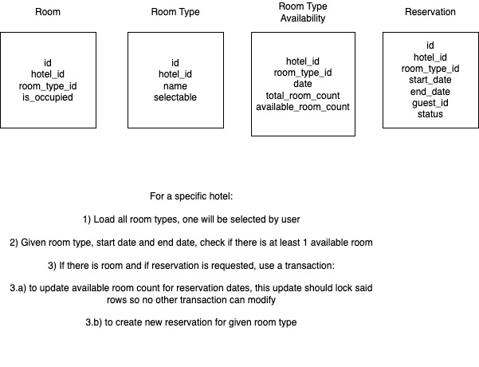
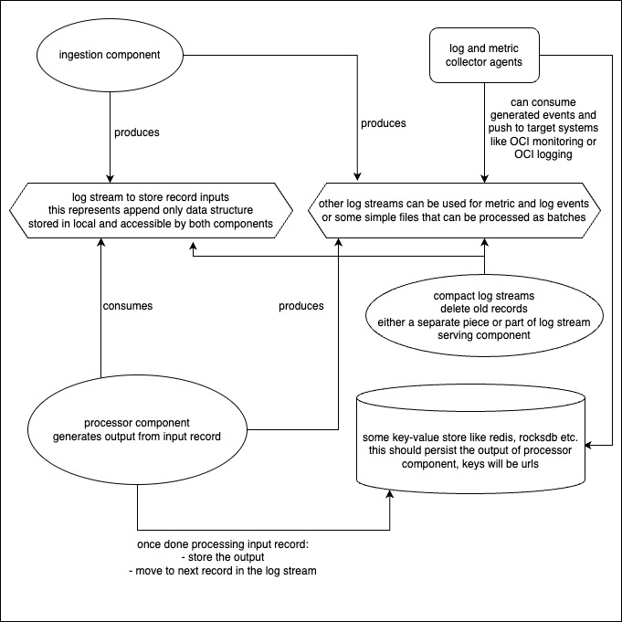

### Concurrent Singly Linked List

- Implement thread-safe singly linked list in your favorite programming language with the following methods:
    - push(Object o) // add node to the end of list
    - pop() // remove last node
    - insertAfter(Object o, Object after) // insert node next to after node
- Don’t use collection libraries (e.g. Java collections) but develop own multi-thread implementation.
- Implement CRUD as REST API for the list.
- Develop automated tests to verify that implementation is deadlock free.

#### Notes

- Make sure to have go 1.21 installed, and test with make commands
    - `make test` will run tests with
      coverage: `ok concurrent-linked-list/list     3.572s  coverage: 100.0% of statements`
    - `make run` will run a basic http server on port 9999 to interact with list
- There is no deadlock detection built-in to list, tests verify that no deadlock occurred by using a timeout
    - Some tests verify deterministic results, like how many nodes to expect in the list after all operations
    - It might be possible to have more deterministic tests if some metrics are added to test, for example knowing how
      many times pop hit an empty list etc.
- First written the straightforward list with a global lock (easy to reason), and confirmed validity of tests
- Then wrote an implementation where there is no single lock but many node specific locks
    - Wrote comments in source code to follow logic easier
    - List's head is handled specially before iterating list, for the sake of easier reasoning
    - Pop (removal from end)
        - requires thread to hold on to two locks at the same time -> left and right node (or current and next node)
        - does not release left node's lock before possible removal operation
    - Push (add to end) and InsertAfter (add to arbitrary node)
        - requires two locks to be taken at one point, to be able to move to next node
        - but left node's lock is released immediately since previous node does not affect current operation
- A simple http server is configured with endpoints for supported list operations
    - Not an API to create/delete a list as a resource
    - Used GET handlers just to easily test in browser, without POST for state changing operations
    - Some basic response message is returned, together with the current size of the list
    - http://localhost:9999/pop
    - http://localhost:9999/push/888
    - http://localhost:9999/insert/999/after/888

---

### Design domain model (diagram and technical document) for Hotel reservation system which will support the following functions:

- User will get a list of all different types of rooms.
- User selects a room type and check the room availability between the specified dates.
- User Makes Reservation.

#### Notes

---

### Design (technical document) a system that processes an infinite stream of data:

- Each record comes as a tuple (url, html content)
- Extract and store the occurrences of: urls, hosts, top-level domains, in/out links of the page
- We have one machine that has enough disk space but limited memory. Write a design document to describe the system
  architecture and data structures as building blocks.

#### Notes

There can be 2 separate threads/processes, running in the same instance, with different focuses:

1. component that ingests records
    - mainly responsible of persisting record input
    - would need only a small buffer, consuming relatively small part of limited memory
    - read incoming record and directly write to some log stream like a kafka partition
    - can block the record producer if it cannot keep up, will continue to read once resources are released

2. component that processes records and stores outputs
    - registered as consumer to same stream that stores url/html tuples
    - read from stream as records come and process every record to generate output (occurrences of urls etc.)
        - can have an in-memory cache to check if exact same url was processed before
        - this cache can be configured with a limited memory (mostly keeping recent records) and can fallback to actual
          key-value store
    - write the url and generated output to some key-value store to persist the result to disk
    - this process can run parallel consumers and can use most of the available memory

