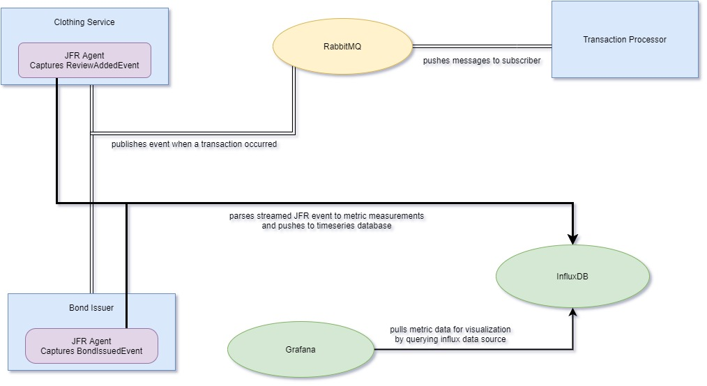

## JFR Stream, RabbitMQ, InfluxDB, Grafana Monitoring Example

This is a simple demonstration project that integrates below pieces:

* Java/Spring applications that were created as simple assignment projects.
    * [Transaction Processor](#logic-in-simple-transaction-processor-2018) - built with maven wrapper as separate module.
    * [Bond Issuer](#logic-in-simple-bond-issuer-2019) - built with gradle wrapper as child module of root, JFR agent is attached.
    * [Clothing Service](#logic-in-simple-clothing-service-2019) - built with gradle wrapper as child module of root, JFR agent is attached.
    * These simple applications are now integrated through **a direct exchange with two queues and a routing key for each queue** to demonstrate a
      basic example of async communication between remote processes with message broker as middleware.
* [JFR agent](#jfr-agent) that is to be attached to java runtime of services that directly writes to InfluxDB.
* Message broker for async communication and async metric dump, [RabbitMQ](https://www.rabbitmq.com/tutorials/amqp-concepts.html).
* Time series database to record metrics, [InfluxDB](https://www.influxdata.com/time-series-database/).
* Metric visualization tool, [Grafana](https://grafana.com/docs/).

When a new bond is created (bond-issuer API), or a new clothing review is created (clothing-service API):

- Services will send an AMQP message to their **configured exchange with different routing keys**. Then transaction-processor, which is subscribed to
  these separate queues, will receive the message and save a new transaction.

- Services will fire up a **JFR event that will then be captured by java agent** that is attached to service process. Event will be enriched with some
  data to be tagged and then will be pushed to InfluxDB. Grafana ([check for usage and examples](README-grafana.md)) can be configured to visualize
  metric data points recorded in InfluxDB.

- These flows can be tested by importing [postman collection](api-postman_collection.json) (has example requests) to trigger API. API of services can
  be explored via `/swagger-ui.html` for both services. Watch the flow:
    - create new bond: POST /bonds
    - create new review: POST /clothing/{ID}/reviews
    - get transaction statistics: GET /statistics

#### Build and Run

> Building all services and agent requires **java 16**.

- Run only clothing-service with JFR agent attached: `gradlew runClothingService`
- Run only bond-issuer with JFR agent attached: `gradlew runBondIssuer`
- Run only transaction-processor: `cd simple-transaction-processor ; mvnw spring-boot:run`
- Run infra resources without applications for local development: `docker-compose up -d rabbitmq influx grafana`
    - Login to rabbit management portal with user and password `guest` to check messages, queues and bindings: `http://localhost:15672/`

- Run every piece together for full integration:
    - Build maven project simple-transaction-processor: `cd simple-transaction-processor ; mvnw clean install`
    - Build gradle project artifacts and copy for docker image creation: `gradlew clean buildAndAssembleAll`
    - Build and run docker images, docker-compose will wait until rabbitmq and influxdb are ready to be connected before running service
      containers: `docker-compose up -d --build`

---

### JFR agent

* This simple java agent is attached to application runtime statically, is used to enable&capture
  [JFR](https://docs.oracle.com/javacomponents/jmc-5-4/jfr-runtime-guide/about.htm#JFRUH170) events.
* Some internal JDK events are logged, only the custom application events are written to time series database (InfluxDB) for demonstration purposes.
* For the sake of simplicity, there is no buffering events in memory, periodically dumping to disk to be collected by some telegraf agent, or any
  other more complex flows, agent writes directly to InfluxDB to keep it simple.

### Logic in simple-transaction-processor (2018)

* Save concurrent transaction requests in memory without using database.
* Statistics of incoming transactions in last 60 seconds can be fetched.
* All transactions can be purged from memory, while accepting new transactions.

### Logic in simple-bond-issuer (2019)

* Client can apply for a bond by providing his personal data, term and amount.
* Default bond coupon (interest rate) is 5% per year and minimal term is 5 years.
* The application follows regulations that have to be validated, a bond can’t be sold if:
    * The application is made between 10:00 PM and 06:00 AM with an amount higher than 1000
    * Reached max number of sold bonds (e.g. 5) per day from a single IP address
* The bond is sold if there are no violations of the regulatory requirements. The newly sold bond reference is returned to the client, otherwise the
  client receives a rejection message.
* Client should be able to adjust the term of his bond. Each term extension results in coupon decreased by 10% of its value. Shortening the term does
  not affect the coupon.
* Client should be able to retrieve whole history of his bonds, including adjustments.

#### Logic in simple-clothing-service (2019)

* There is example Postman collection to test API. For a basic API docs: `http://localhost:8080/swagger-ui.html`
* Shirts come in sizes small, medium, and large.
* Shirts come in the color options of red, black, blue, green, and white.
* Each article of clothing should also include a description of the clothing (any text is fine with a maximum of 2000 characters).
* Each article of clothing should also have a rating associated with it that any ordinary shopper can provide (the rating should come in the form of a
  text review no longer than 2000 characters and a star rating between 1 and 5). Both are required fields.
    * Once an article of clothing’s review has reached 5 reviews and the average review is 2 stars or below, reviewing that article of clothing should
      be prohibited and no future reviews should be accepted.
    * Once an article of clothing’s review has reached 5 reviews and the average review is 4 stars or above, the article of clothing should be labeled
      as “HOT”.
    * An article of clothing that was previously “HOT” can still become prohibited for future reviews if it drops below the minimum average star
      rating threshold (at least 5 reviews and 2 stars or below average).
* Articles of clothing should be searchable by their text description (prefix match), color, brand, size, “HOT” status, and average review stars
  rounded up to the nearest whole number (e.g. an article with an average review of 2.1 would be found when searching for items with 3 stars).
* The API does not need to allow creation of new brands or articles of clothing.
