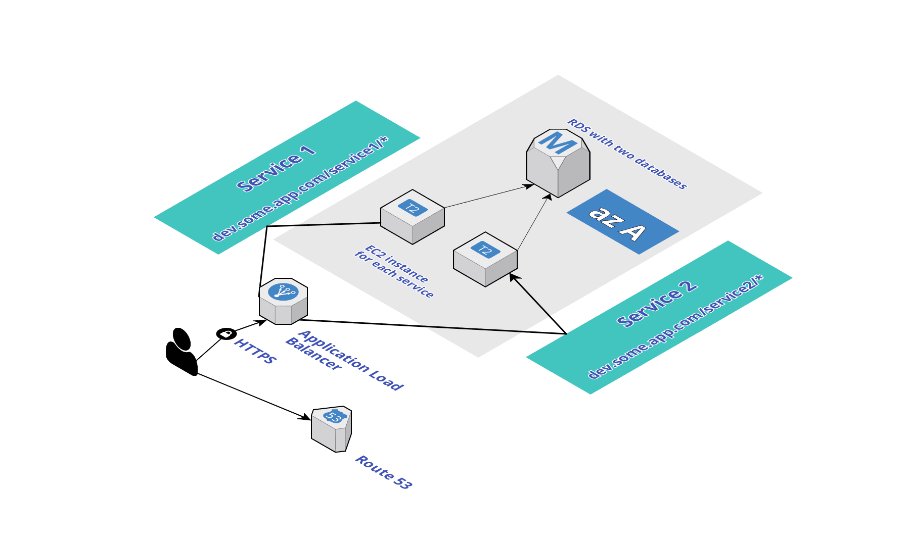

### Terraform/AWS Example

* Basic infrastructure as code example with terraform for provisioning AWS resources (ALB, EC2, RDS etc.) in cloud.
* Not everything here makes sense or is the perfect practice, this is a simple PoC project to learn and experiment with Terraform (v0.11.6).
* Separate infrastructure topology is defined under `network` folder for different environments.
* Under `application` folder, sample infra for SomeApp is created as defined in below CloudCraft drawing:

* Some helpful resources:
   
    * [Official docs](https://www.terraform.io/docs/configuration/index.html)
    * [GruntWork terraform guide](https://blog.gruntwork.io/a-comprehensive-guide-to-terraform-b3d32832baca)
    * [Some best practices guide](https://www.terraform-best-practices.com/)
    * [Article for structure and layout](https://surminus.github.io/post/terraform-structures-and-layouts/)
