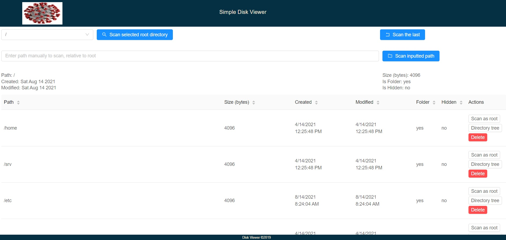
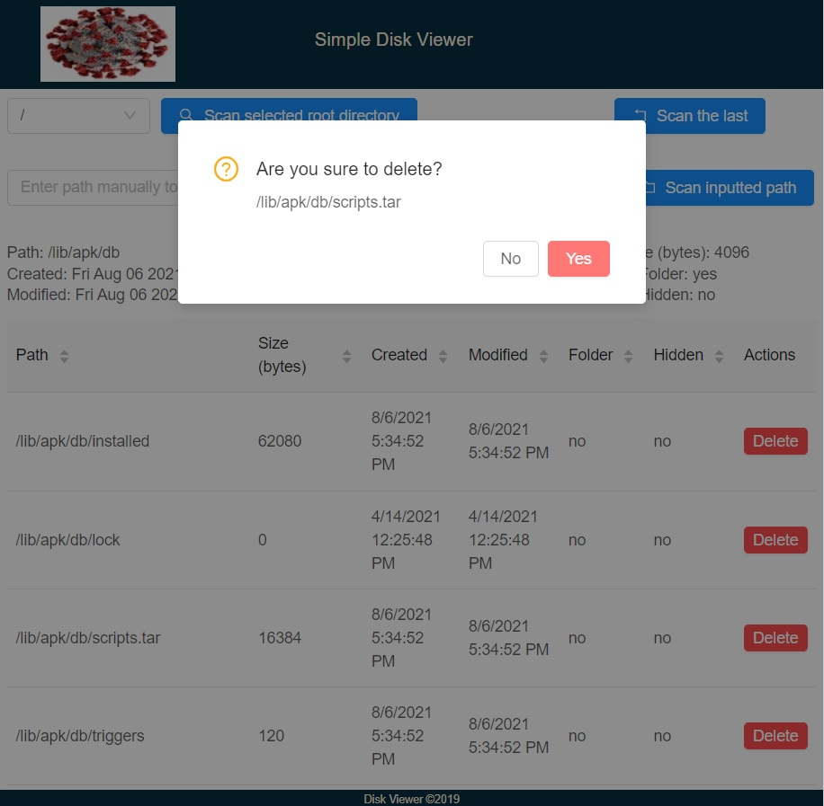
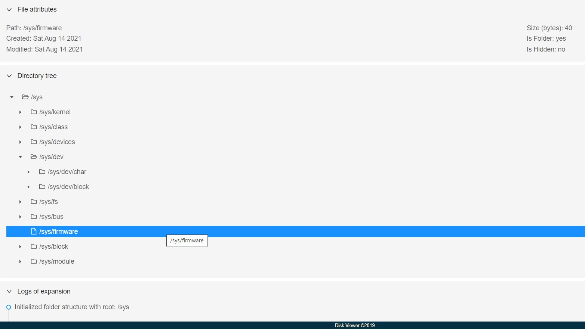

## Simple Disk Viewer

- Used ktor/kotlin (netty is the web server), gradle, cucumber, javascript/react/mobx/antd and yarn.
    - Environment configuration is discarded for this project, everything is hardcoded.
      `io.ktor.server.netty.EngineMain` can be used to run server by loading environment
      specific `-config=application.conf`.
    - Dependency injection is not used since this is a small example application.
    - Used [watchservice-ktx](https://github.com/vishna/watchservice-ktx) to use Java WatchService from Kotlin.
- Files and directories can be listed by a root path and depth level.
    - Basic file attributes will be returned as details of file.
    - If file is directory and has more files inside, the children will also be returned if they are in the depth level.
    - Files or folders can be deleted by their path.
    - Roots of the filesystem can be fetched (windows can have multiple) and this root is used as starting point to
      traverse directories.
- File system events (Created, Modified, Deleted) for a specific directory can be observed by subscribing to the GET
  endpoint `/observe`, client will receive a text stream (SSE).
    - Main page will automatically subscribe to the event stream of the scanned path to list all folders and files. UI
      will update itself up to the server-sent events (Created, Modified, Deleted) occurring in the filesystem.

### Backend

- Some integration tests will be run when packaging. Unit tests are discarded to not mock Files API calls or File&Path
  objects. Use argument `-x test` to skip tests while building if there is file system path problem.
- Gradle will build and package application as fat jar with static frontend resources included. Gradle can also build
  docker image too, will create image `disk-viewer:1.0`:
    - `gradlew clean buildFrontend build`
    - `gradlew clean buildFrontend buildImage`
- Run application by different log level with params `log.level.app` or `log.level.root`:
    - `java -Dlog.level.app=INFO -jar app.jar`
- Run application as docker container:
    - `docker run -d -p 8080:8080 --name dsp disk-viewer:1.0`
    - `docker logs -f --tail 100 dsp`
- Go to `localhost:8080` to check working app. Basic postman collection `disk-viewer.postman_collection` can be imported
  to Postman to test API.

### Frontend

- Gradle module is for installing nodejs and yarn locally in frontend folder to build sources and run development server
  without requiring global yarn&node installation on host machine.
- `gradlew frontend:yarn` to install dependencies from package.json.
- `gradlew frontend:buildFrontend` to build production sources via react-scripts.
    - Production build will be generated under `build`, these will be copied to jar while building application.
- To run the node server for local development:
    - `yarn install` or `gradlew frontend:yarn` to install node_modules.
    - `yarn startWith8900` to run frontend by listening port 8900.
    - If `REACT_APP_USE_MOCK` is set to `false`, it will use `REACT_APP_BACKEND_URL` as backend. Backend server is
      configured to let CORS requests.

### Pictures

---

---

