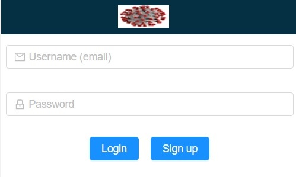
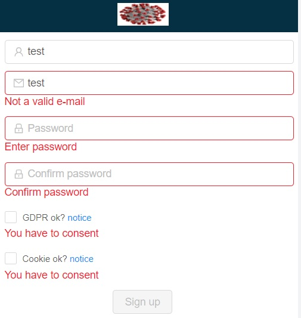
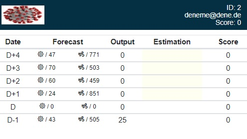
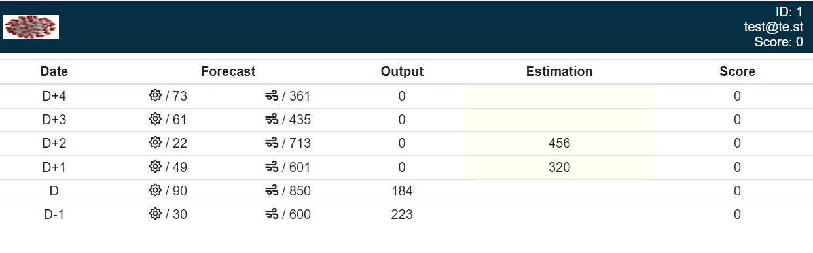
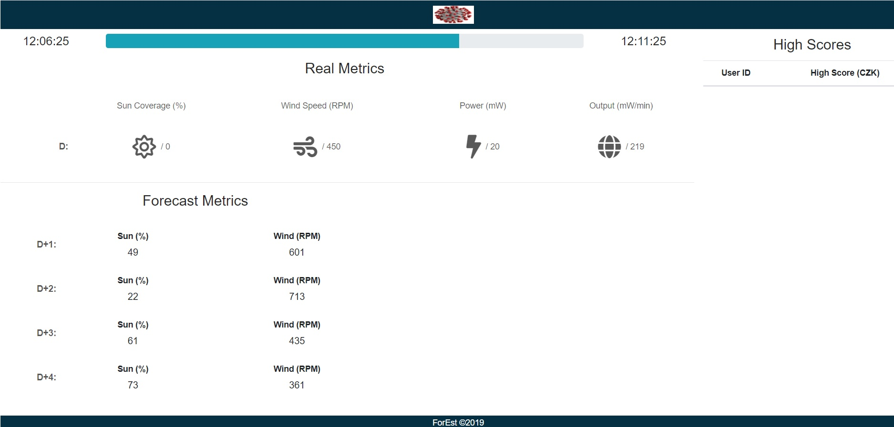

## Spring Boot/React/Websocket Example

* Example application to build react frontend and serve from tomcat server.
    * Docker image for application binary is built from base zulu alpine jre image.
    * Frontend is built via react and antd component library, it has responsive css for every page.
    * Backend is modified over already written existing code (dto, controller, logic in services etc.), it is spring
      boot application with embedded tomcat server.
    * Backend has websocket channels to update connected client in configurable time intervals.

* Simulation can be started with actions in order:
    * POST to `/sign-in` with `username: admin, password: admin` (as valid json) to get JWT.
    * Use received token to POST to `/tasks` to restart forecast simulation.
    * `simple-forecast-estimation.postman_collection` can be imported to execute `/tasks`.

### Backend

* Requires mongodb v3.4 to connect as database, yarn v1.22.5 and node v14.17.4 for installing frontend module.
* `localhost.p12` is generated, key and cert are exported for WebpackDevServer to load when running frontend on nodejs:
    * `keytool -genkeypair -alias local -keyalg RSA -keysize 2048 -storetype PKCS12 -keystore localhost.p12 -validity 3650`
    * `openssl pkcs12 -nocerts -out localhost.key -in localhost.p12`
    * `openssl pkcs12 -nokeys -out localhost.crt -in localhost.p12`
* Run backend for local development:
    * `docker-compose -f docker-compose-mongo.yml up -d`
    * `java -Dspring.profiles.active=local -jar BundledApp.jar`
* Package BundledApp.jar with react production build included, then run it together with mongo database:
    * `mvn clean package`
    * `docker-compose up -d --build`

### Frontend

* Navigate to frontend folder run `yarn start` from terminal to start dev server listening on 3000.

* Use `set HTTPS=true&&yarn start` to start with https enabled.
    * react-scripts -> start.js uses webpack-dev-server -> lib -> Server.js, update below part to use custom certificate
      that you also use for your backend server:

```javascript
if (typeof options.https === 'boolean') {
    options.https = {
        ca: fs.readFileSync('<frontend-module-path>\\cert\\localhost.crt'),
        pfx: options.pfx,
        key: fs.readFileSync('<frontend-module-path>\\cert\\localhost.key'),
        cert: fs.readFileSync('<frontend-module-path>\\cert\\localhost.crt'),
        passphrase: 'localhost',
        requestCert: false
    };
}
```

### Pictures

* Login screen as index page:



---

* Signup form:



---

* Forecasting future dates:





---

* Real data to check forecast against:

